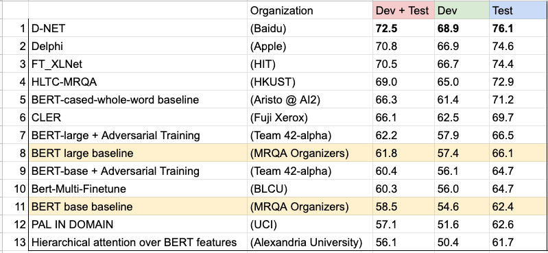

# MRQA 2019 Shared Task
The 2019 MRQA Shared Task focuses on **generalization**.
We release an official training dataset containing examples from existing QA datasets, and evaluate submitted models on ten hidden QA test datasets.
Train and test datasets may differ in some of the following ways:
- **Passage distribution**: Test examples may involve passages from different sources (e.g., science, news, novels, medical abstracts, etc) with pronounced syntactic and lexical differences.
- **Question distribution**: Test examples may emphasize different styles of questions (e.g., entity-centric, relational, other tasks reformulated as QA, etc) which may come from different sources (e.g., crowdworkers, domain experts, exam writers, etc.)
- **Joint distribution**: Test examples may vary according to the relationship of the question to the passage (e.g., collected independent vs. dependent of evidence, multi-hop, etc)

Both train and test datasets have the same format and this year we focus on extractive question answering. That is, given a question and context passage, systems must find a segment of text, or span in the document that best answers the question. While this format is somewhat restrictive, it allows us to leverage many existing datasets, and its simplicity helps us focus on out-of-domain generalization, instead of other important but orthogonal challenges.

Each participant will submit a single QA system trained on the provided training data.
We will then privately evaluate each system on the hidden test data.

## ****NEW**** Shared Task Results
We are very pleased to announce our shared task results:

Congratulations to the teams from **Baidu, Apple and Harbin Institute of Technology** for winning the top 3 in the shared task!  
Please find more details in our report: [MRQA 2019 Shared Task: Evaluating Generalization in Reading Comprehension](https://arxiv.org/abs/1910.09753).
All the shared task papers are available at [https://mrqa.github.io/papers](https://mrqa.github.io/papers).

## Training Datasets

All participants are required to use our official training corpus (see our [GitHub repository](https://github.com/mrqa/MRQA-Shared-Task-2019) for details),
which consists of examples pooled from the following datasets:
- [SQuAD](https://arxiv.org/abs/1606.05250) (Rajpurkar et al., 2016)
- [NewsQA](https://arxiv.org/abs/1611.09830) (Trischler et al., 2016)
- [TriviaQA](https://arxiv.org/abs/1705.03551) (Joshi et al., 2017)
- [SearchQA](https://arxiv.org/abs/1704.05179) (Dunn et al., 2017)
- [HotpotQA](https://arxiv.org/abs/1809.09600) (Yang, Qi, Zhang, et al., 2018)
- [NaturalQuestions](https://ai.google/research/pubs/pub47761) (Kwiatkowski et al., 2019)

**No other question answering data may be used for training.**
We allow and encourage participants to use off-the-shelf tools for linguistic annotation (e.g. POS taggers, syntactic parsers),
as well as any publicly available unlabeled data and models derived from these (e.g. word vectors, pre-trained language models).

## Dev & Test Datasets

For development, we release [development datasets](https://github.com/mrqa/MRQA-Shared-Task-2019#out-of-domain) for **six** out of the ten test datasets (out-of-domain):
- [BioASQ](http://bioasq.org/)
- [DROP](https://arxiv.org/abs/1903.00161) (Dua et al., 2019)
- [DuoRC](https://arxiv.org/abs/1804.07927) (Saha et al., 2018)
- [RACE](https://arxiv.org/abs/1704.04683) (Lai et al., 2017)
- [RelationExtraction](https://arxiv.org/abs/1706.04115) (Levy et al., 2017)
- [TextbookQA](http://ai2-website.s3.amazonaws.com/publications/CVPR17_TQA.pdf) (Kembhavi et al., 2017)

In addition, we also provide ["in-domain" dev datasets](https://github.com/mrqa/MRQA-Shared-Task-2019#in-domain) to be used for helping develop models.
The final testing, however, will only contain out-of-domain data.

We will keep the other fix test datasets hidden until the conclusion of the shared task.
We hope this will prevent teams from building solutions that are specific to our test datasets,
but do not generalize to other datasets.

Note: while the development data can be used for model selection,
**participants should not train models directly on the development data**.

#### ****NEW**** Test Datasets
The final six hidden test sets we used are:
- [BioProcess](https://www.aclweb.org/anthology/D14-1159v2.pdf) (Berant et al, 2014)
- [ComplexWebQuestions](https://www.aclweb.org/anthology/N18-1059.pdf) (Talmor and Berant, 2018)
- [MCTest](https://www.aclweb.org/anthology/D13-1020.pdf) (Richardson et al, 2013)
- [QAMR](https://www.aclweb.org/anthology/N18-2089.pdf) (Michael et al, 2018)
- [QAST](http://www.lrec-conf.org/proceedings/lrec2008/pdf/511_paper.pdf) (Lamel et al, 2008)
- [TREC](http://ailao.eu/yodaqa/yodaqa-clef2015.pdf) (Baudis and Sedivy, 2015)

## Evaluation

Systems will first be evaluated using automatic metrics: exact match score (EM) and word-level F1-score (F1).
EM only gives credit for predictions that exactly match the gold answer(s),
whereas F1 gives partial credit for partial word overlap with the gold answer(s).
We will judge systems primarily on their (macro-) average F1 score across all test datasets.

Time and resources permitting, we plan to run human evaluation on the top few systems with the highest overall score.
Human evaluators will directly judge whether top systems’ predictions are good answers to the test questions.

After models have been submitted, we will release anonymized, interactive web demos for
high-performing models.
Anyone will be able to pose their own questions to these models,
in order to better understand their strengths and weaknesses.
We will report on these findings at the workshop.

## Data Format and Submission Instructions

We detail data format and submission instructions, along with our baseline models,
in this [GitHub repository](https://github.com/mrqa/MRQA-Shared-Task-2019).
For any inquiry about the shared task and the submission, please make a new **issue** in the repository.

## Registration
Please register your team through [this form](https://forms.gle/wBy5Ph3WWgGPw9dY7).

## Important Dates

- **May 2, 2019**: [Training datasets released](https://github.com/mrqa/MRQA-Shared-Task-2019#training-data)
- **May 13, 2019**: [Development datasets released](https://github.com/mrqa/MRQA-Shared-Task-2019#out-of-domain)
- ~~July 29~~ ~~August 5~~ **August 9, 2019 (11:59 PM PST)**: [Deadline for model submission](https://github.com/mrqa/MRQA-Shared-Task-2019#submission) (we extended the deadline by 11 days)
- **August 12, 2019**: Test results announced
- **August 30, 2019**: System description paper submission deadline
- **September 16, 2019**: Acceptance notification and reviews shared with authors
- **September 30, 2019**: System description paper camera-ready deadline

All submission deadlines are 11:59 PM GMT-12 (anywhere in the world) unless otherwise noted.

## Questions?
For any questions regarding our shared task, please use [Github issues](https://github.com/mrqa/MRQA-Shared-Task-2019/issues). We are here to answer your questions and looking forward to your submissions!
